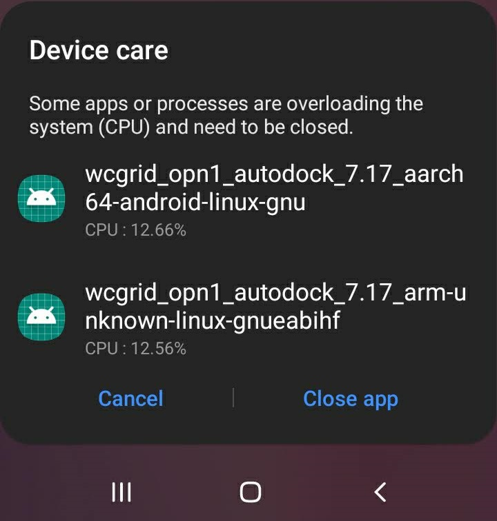

## GNU/Linux platform support (EXPERIMENTAL)

Image: A warning of running Android and Linux WCG tasks at the same time

### TLDR

<b>A patch is now available to allow running both Android tasks and Linux tasks at the same time. This patch allows selectively run GNU/Linux tasks via proot and run Android tasks without proot.</b>

You need to install `proot` within Termux and build BOINC from repo with this patch applied to take advantage of `proot`. You also need to add the relevant `<alt_platforms>` strings to `cc_config.xml` to request tasks. See [platform name section](../README.md#platform-compatibility-table). Always choose same / compatible platforms with your Android device. Unset `LD_PRELOAD` for 32bit support should not be necessary with this patch.

This also means it is possible to run Linux ARM GPU apps where Android version is not available. See [OpenCL section](../README.md#opencl-platform-support) to add OpenCL library to BOINC. Note this is experimental and your device might have shorter life span! Use at your own risk!

### Background

Android uses Bionic `libc` and `libc++`. GNU/Linux uses `glibc` and `libstdc++`. There are some differences in system calls and Bionic usually have fewer calls implemented compared to glibc but newer Android version seems to add back. Refer <https://android.googlesource.com/platform/bionic/+/master/libc/libc.map.txt>.

Since BOINC tasks use a few subset of calls that are available in both libraries, its possible for Linux and Android to cross run tasks from each other using a helper app. No real emulation is required as long as the architectures are same / compatible.

For Android to run Linux tasks, we can use [proot](https://github.com/proot-me/proot). We use [Termux fork of proot](https://github.com/termux/proot) as it has some patches to work on Android. Requires at least Android 6.0 (API 23). Proot also fakes some system calls that are normally blocked by Android seccomp filter.

For Linux to run Android tasks, I am researching [libhybris](https://github.com/libhybris/libhybris). WIP probably. Its even possible to use Wine to run Windows tasks (x86_64 and x86)? More TODO here.

The idea of cross running was lead from the clever use of `proot` on Termux to run Linux distro and apps on Android unmodified. After checking [how Termux guys deals](https://github.com/termux/termux-packages/issues/4065) with issues that can be workaround using `proot`, in which their fix is to remove the system calls within the source files, so far I come to the conclusion this isn't something that can be easily fix since it is the science apps that make these calls (not the client) and their sources aren't easily accessible. However, when running BOINC with `proot`, you can run Linux tasks but will lose the ability to run Android tasks. With this in mind, a patch was written to take advantage of `proot` to run Linux version of science apps.

### Platform compatibility table

<table>
<thread>
<tr>
<th>Device architecture (Android)</th><th colspan=4>Project platform (Android)</th><th colspan=4>Project platform (GNU/Linux)</th>
</tr>
</thread>
<tbody>
<tr><td></td><td>aarch64</td><td>arm</td><td>x86_64</td><td>x86</td><td>aarch64</td><td>arm</td><td>x86_64</td><td>x86</td></tr>
<tr><td>aarch64</td><td>Yes</td><td>LDP</td><td>No</td><td>No</td><td>proot</td><td>LDP + proot</td><td>No</td><td>No</td></tr>
<tr><td>arm*</td><td>No</td><td>Yes</td><td>No</td><td>No</td><td>No</td><td>proot</td><td>No</td><td>No</td></tr>
<tr><td>x86_64**</td><td>?</td><td>?</td><td>Yes</td><td>LDP</td><td>?</td><td>?</td><td>proot</td><td>LDP + proot</td></tr>
<tr><td>x86**</td><td>?</td><td>?</td><td>No</td><td>Yes</td><td>?</td><td>?</td><td>No</td><td>proot</td></tr>
</tbody>
</table>

Notes:
\
Yes = It works
\
No = Just No
\
LDP = Unset `LD_PRELOAD`
\
proot = Prepend `proot`
\
\* = I don't have 32bit ARM devices that are new enough to run Termux. These are based on assumptions. You will be better off using official BOINC app.
\
\** = I don't have x86 devices to run Termux. These are based on assumptions.
\
? = Some x86 devices have `libhoudini.so`. I am not sure what will happen. But there will be performance issues. Generally assume No.